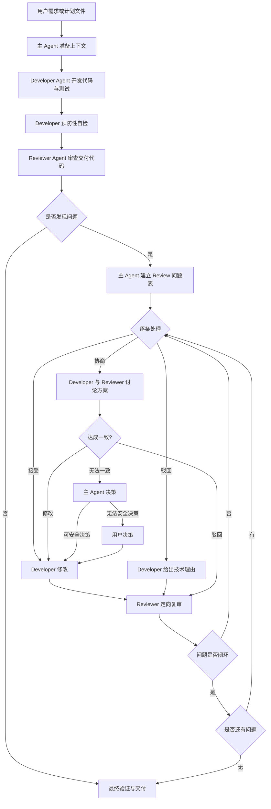

# Workflow Overview

## 整体流程

## 角色分工

- **主 Agent**：准备上下文、派发 Developer/Reviewer、维护 review 状态表、处理争议升级、向用户简短汇报关键环节。
- **Developer Agent**：按需求开发代码和测试，主动遵循 `GO_STANDARDS.md`、KKEM 测试规范和 review lenses，交付前尽量修掉可预防问题。
- **Reviewer Agent**：运行或参考内置工具链，按 safety/data/design/quality/observability/business/naming/testing 维度审查，并输出中文 P0/P1/P2 问题。

## 闭环结果

最终交付时必须列出每个 Reviewer 问题的处理结果：

- Developer 修改后 Reviewer 接受。
- Developer 直接驳回后 Reviewer 接受。
- 双方讨论后修改并被 Reviewer 接受。
- 双方讨论后驳回并被 Reviewer 接受。
- 主 Agent 决策后闭环。
- 用户决策后闭环。
